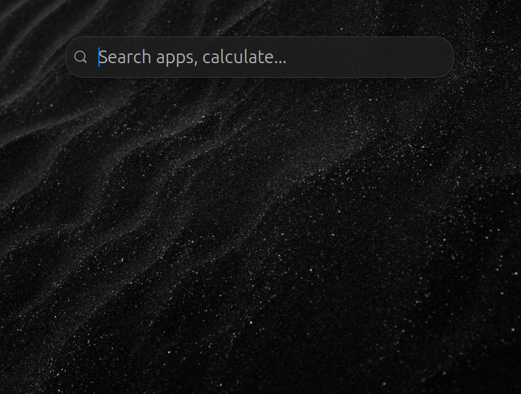
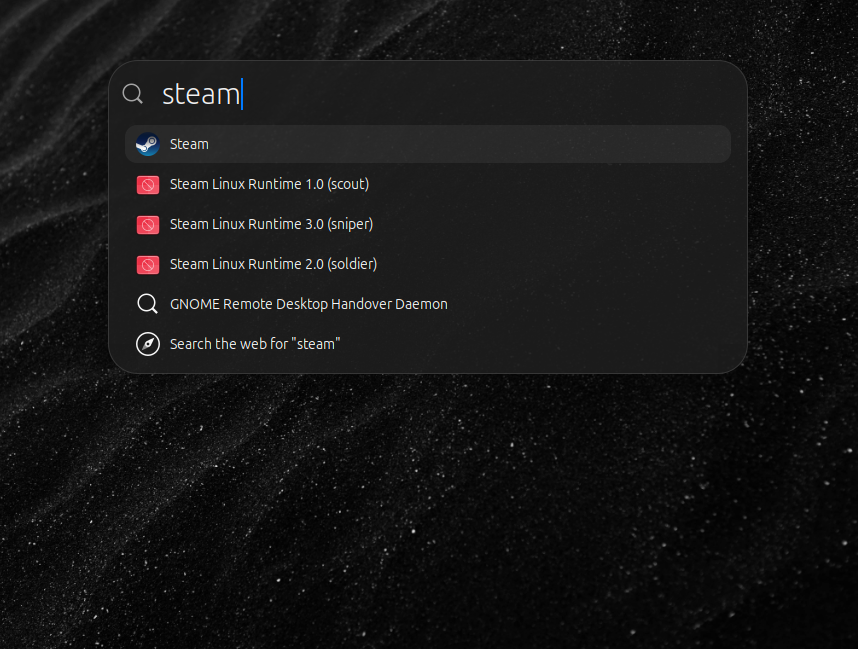
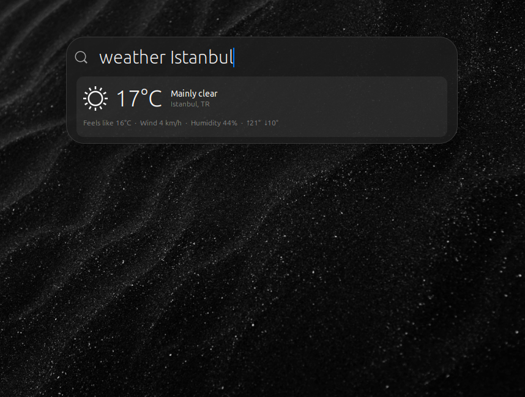
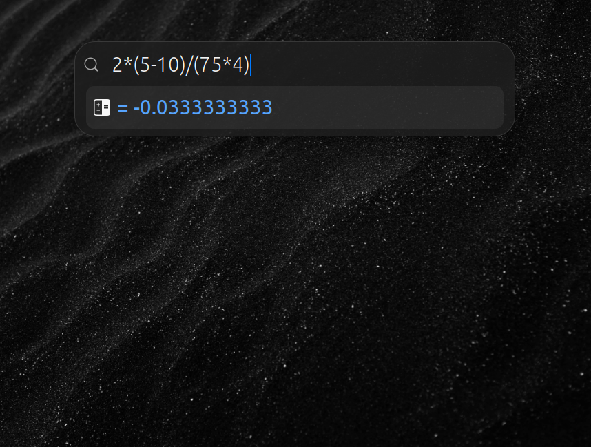
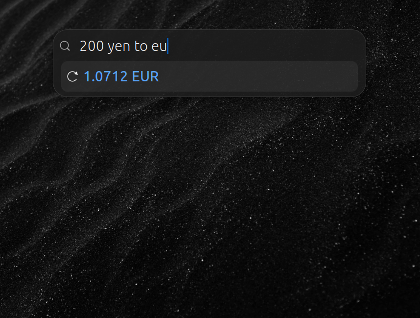
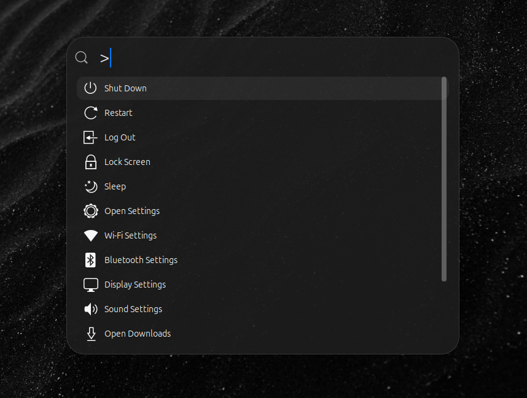
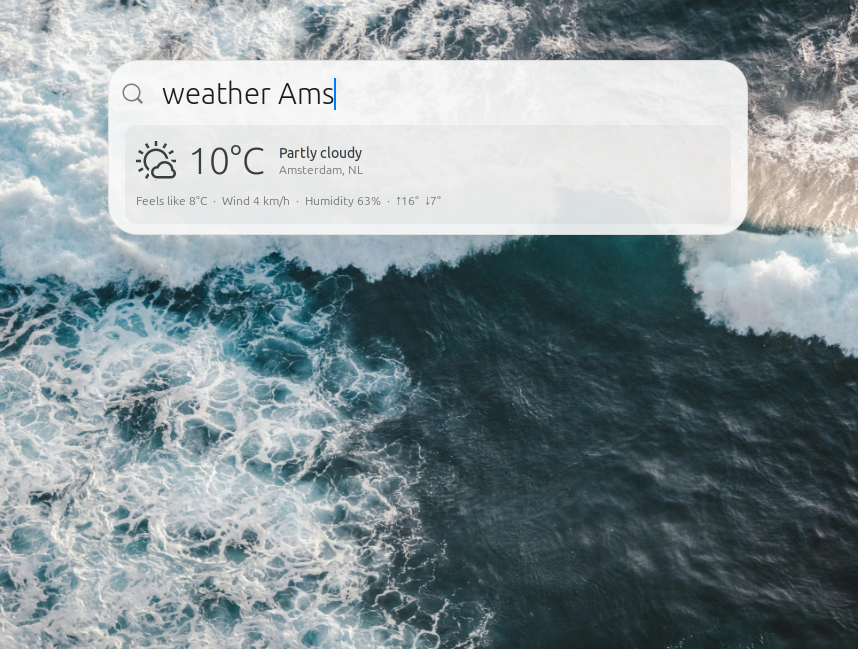
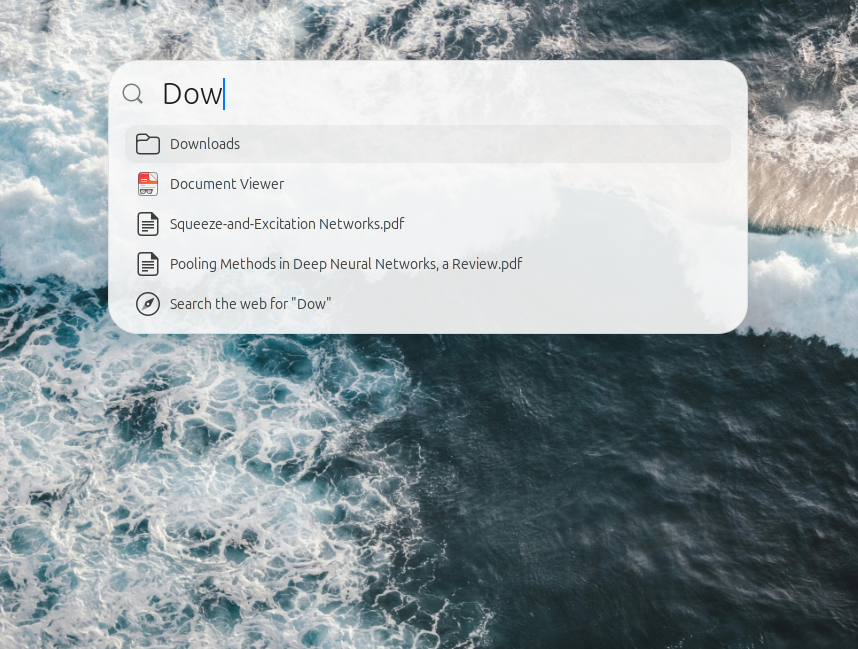

# Superbar

A keyboard-driven, system-wide launcher and command bar for GNOME Shell — inspired by macOS Spotlight.

Open it from anywhere with **Ctrl+Alt+Space**.


---

## Screenshots

| | |
|---|---|
|  |  |
|  |  |
|  |  |
|  |  |

---

## Features

| Feature                   | How to use                                                             |
| ------------------------- | ---------------------------------------------------------------------- |
| **App Launcher**          | Type the app name — fuzzy match, launches or focuses                   |
| **Window Switcher**       | Type part of a window title — jumps across workspaces                  |
| **File Search**           | Type a filename — searches home dir and common folders                 |
| **Clipboard History**     | `clip:` or `clipboard:` prefix — browse last 50 entries                |
| **Weather**               | `weather <city>` — live temp, humidity, wind (Open-Meteo, no API key)  |
| **Calculator**            | Type a math expression e.g. `2 * (3 + 4)` — result copied to clipboard |
| **Currency Converter**    | `100 USD to EUR`                                                       |
| **Dictionary**            | `define <word>` — English definitions via Free Dictionary API          |
| **Web Search**            | Any unmatched query falls through to a web search                      |
| **System Commands**       | `shutdown`, `reboot`, `logout`, `lock`, `suspend`, `screenshot`        |
| **Configurable Shortcut** | Change the toggle keybinding in GNOME Extensions preferences           |

---

## Installation

### From GNOME Extensions (recommended)

Install from [extensions.gnome.org](https://extensions.gnome.org) — search for **Superbar**.

### Manual

```bash
git clone https://github.com/Furkan-rgb/superbar.git \
  ~/.local/share/gnome-shell/extensions/superbar@Furkan-rgb.github.io

glib-compile-schemas ~/.local/share/gnome-shell/extensions/superbar@Furkan-rgb.github.io/schemas/

gnome-extensions enable superbar@Furkan-rgb.github.io
```

Log out and back in if this is the first time installing.

---

## Requirements

- GNOME Shell 49+
- An internet connection for weather, dictionary, and currency features

---

## License

GPL-2.0 — see [LICENSE](LICENSE)
