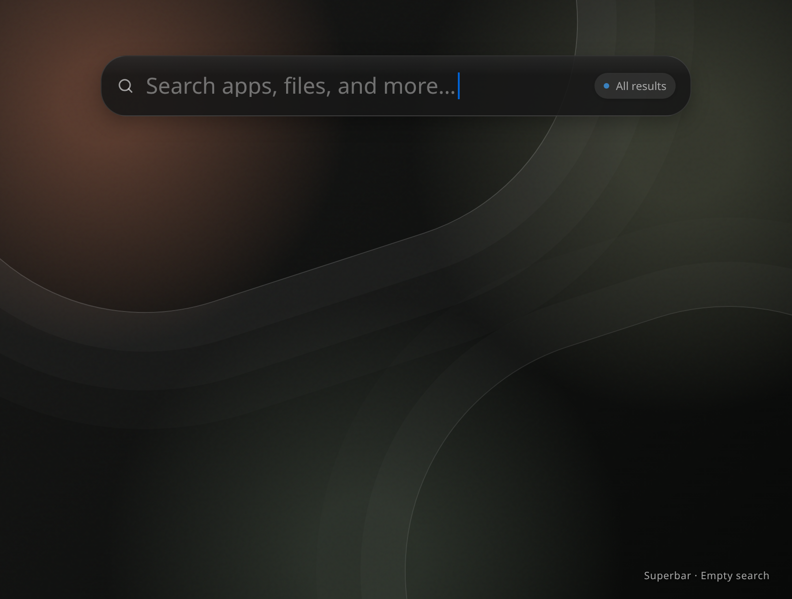
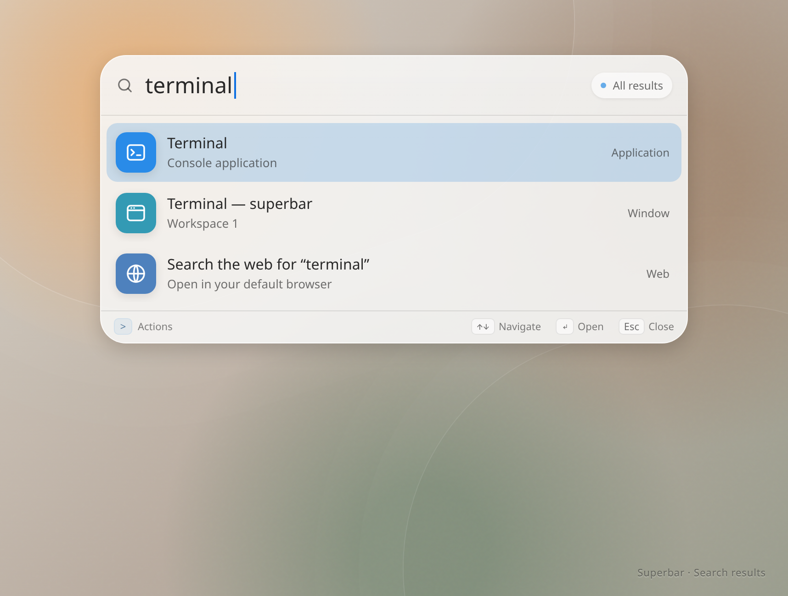
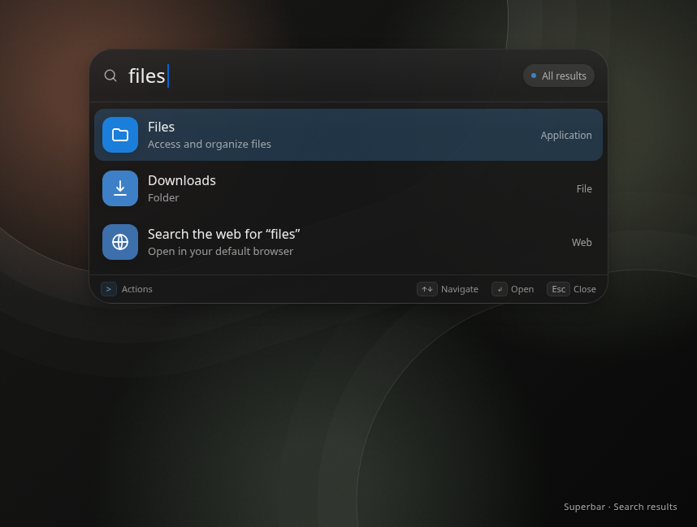
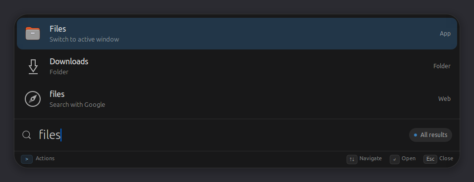
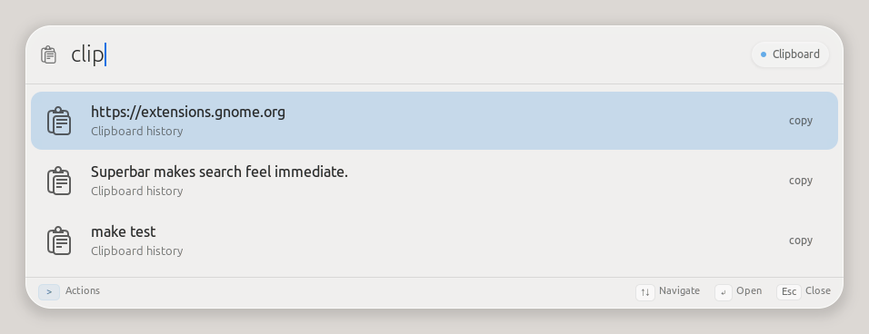
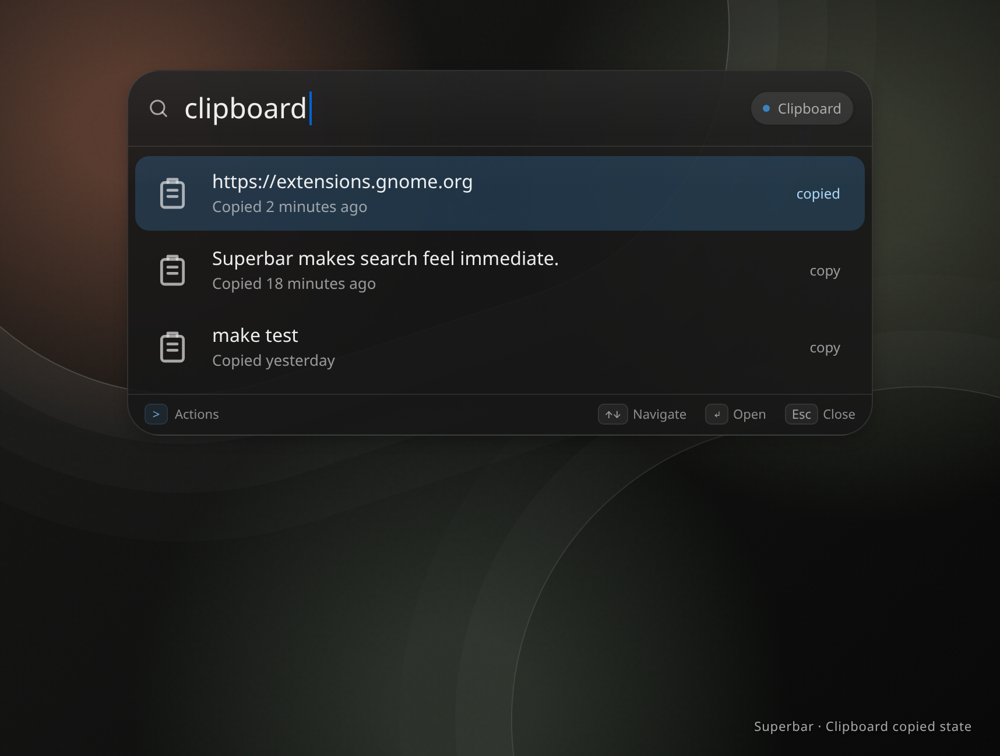
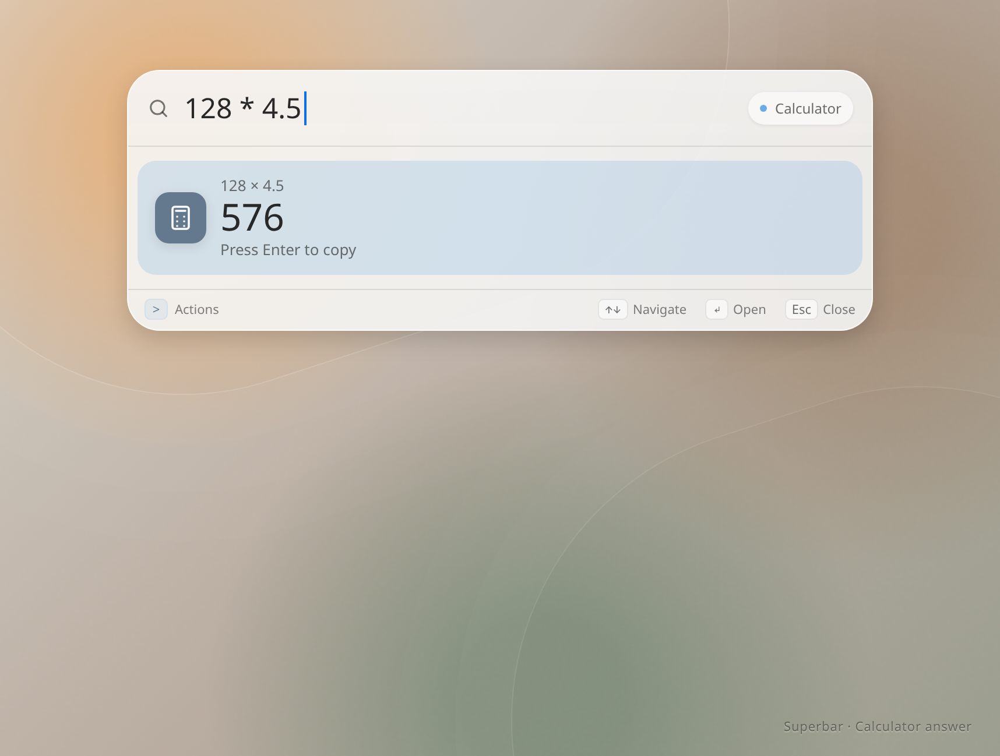
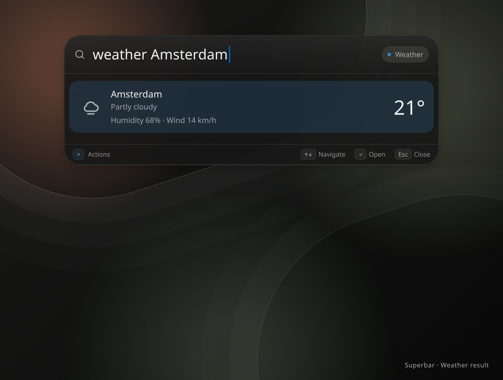

# Superbar

A launcher and command bar for GNOME Shell, inspired by macOS Spotlight. Press
**Alt+Space** by default and start typing. The shortcut can be changed in
Superbar preferences.


---

## Screenshots

|                                                                    |                                                                           |
| ------------------------------------------------------------------ | ------------------------------------------------------------------------- |
|                         |                          |
|                     |          |
|             |          |
|            |                           |

---

## Features

| Feature                   | How to use                                                             |
| ------------------------- | ---------------------------------------------------------------------- |
| **App Launcher**          | Type an app name to launch it or focus it if it is already open        |
| **Settings Search**       | Find and open panels such as Displays or Color Management              |
| **GNOME Search Providers** | Include results supplied by Settings, Files, Calendar, and other apps |
| **Window Switcher**       | Search window titles, including windows on other workspaces            |
| **File Search**           | Search common folders and files in the LocalSearch or Tracker index    |
| **Clipboard History**     | Start with `clip`, `clipboard`, or `history`                            |
| **Weather**               | Try `weather Amsterdam`                                                 |
| **Calculator**            | Type `2 * (3 + 4)`, then press Enter or click the result to copy it     |
| **Currency Converter**    | Type `100 USD to EUR`, then press Enter or click the result to copy it  |
| **Dictionary**            | `define word`                                                          |
| **Web Search**            | Open unmatched searches with your preferred search engine              |
| **System Actions**        | Start with `>`, `cmd`, `command`, or `action`                          |
| **Resumable Searches**    | Reopen the bar within five minutes to resume your previous search       |
| **Adaptive Ranking**      | Apps and actions you choose can rank higher; learned ranking is resettable |
| **Multi-monitor Support** | Opens on the monitor you are currently using                           |
| **Clipboard Controls**    | Toggle monitoring, set the history limit, or clear saved history       |
| **Appearance Settings**   | Pick the theme, colors, opacity, width, position, and result count      |
| **Search Source Controls** | Enable or disable each built-in source from Superbar preferences      |

---

## Installation

### GNOME Extensions

Superbar has been submitted to extensions.gnome.org and is currently waiting
for review. Until it is approved, it can be installed manually.

[Superbar on extensions.gnome.org](https://extensions.gnome.org/extension/9778/superbar/)

### Manual

Download `superbar@Furkan-rgb.github.io.shell-extension.zip` from the
[latest GitHub release](https://github.com/Furkan-rgb/superbar/releases/latest),
then install it with:

```bash
gnome-extensions install --force \
  ~/Downloads/superbar@Furkan-rgb.github.io.shell-extension.zip
gnome-extensions enable superbar@Furkan-rgb.github.io
```

Log out and back in if this is the first time installing. For every pushed
version tag matching `v*`, GitHub Actions builds and checks the packaged ZIP,
then attaches it to a GitHub release.

---

## Requirements

- GNOME Shell 49 or 50
- An internet connection for weather, dictionary, and currency features
- LocalSearch (`localsearch`) or Tracker 3 (`tracker3`) for indexed file
  results; common-folder results remain available without either command

## Makefile commands

```bash
make help
make test       # validate, build, and verify the ZIP
make unit       # run all unit tests
make install    # install the latest local build
make nested     # install and start a fresh nested GNOME Shell
make renders    # rebuild the README images
make export     # export the upload-ready ZIP to build/; does not install
```

The generated archive is always named
`superbar@Furkan-rgb.github.io.shell-extension.zip`. `make export` writes it to
the repository's `build/` directory but does not update the installed extension.

GitHub Actions also checks and packages every pull request and push to `main`.
Those builds are available as temporary workflow artifacts. Pushing a new,
unused version tag matching `v*` and the form `vMAJOR.MINOR.PATCH` additionally
creates a GitHub release and attaches the installable ZIP to it.

## A few UI details

The default light color is a neutral off-white and the dark color is charcoal.
There are a handful of alternatives for both, or Superbar can match the
semantic surface, foreground, and accent colors used by GNOME applications.
The GNOME-app palette follows light/dark and accent preference changes live.
Background opacity can be set from 65% to 100%. It defaults to 90%.

The bar can sit at the top, center, or bottom of the screen. At the bottom, the
results open upward and the footer remains below them. Center is the default.

Search results stay in one list rather than being split into tabs. The small
label beside the search field shows when Superbar has recognized something like
a clipboard, calculator, weather, dictionary, currency, or system-action query.
Web searches use Google by default. This can be changed in settings to
DuckDuckGo, Bing, Brave Search, Ecosia, or Startpage.

Superbar also follows GNOME's enabled app search providers and their configured
order. Results from providers such as Settings, Files, Calendar, Characters,
and Software appear in the same result list with their source name. The Search
Sources preferences page controls Superbar's built-in sources and links to the
system Search panel for managing app-provided results. Search terms are sent
over the local session bus to each enabled provider; individual providers may
use their own local or network-backed search services.

When working on the Shell UI, use a fresh nested session so an older cached copy
of the extension does not get in the way:

```bash
make nested

# Run this from the repository in the nested desktop:
make enable

# Then press Alt+Space.
```

`make status` shows whether the extension is enabled. Use `make prefs` to open
its settings.

---

## License and credits

Copyright © 2026 Furkan.

Superbar is licensed under GPL-2.0-or-later — see [LICENSE](LICENSE).

Superbar uses GNOME Shell APIs, including clipboard access. Weather data comes
from Open-Meteo (`open-meteo.com`), definitions from Free Dictionary API
(`dictionaryapi.dev`), and exchange rates from Frankfurter
(`frankfurter.app`). These services and clipboard access are also declared in
`metadata.json`.
