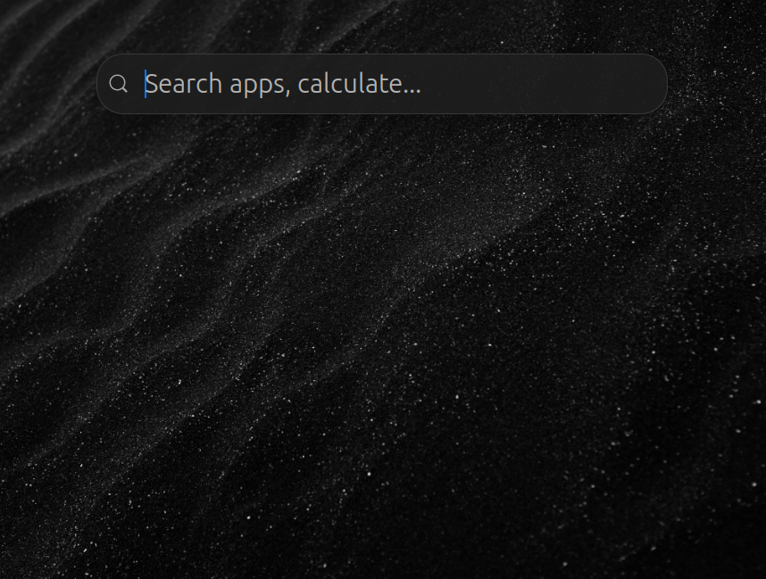
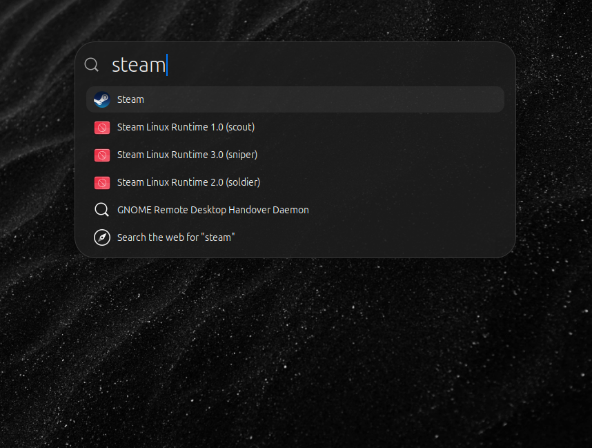
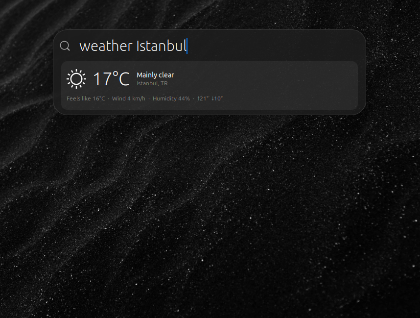
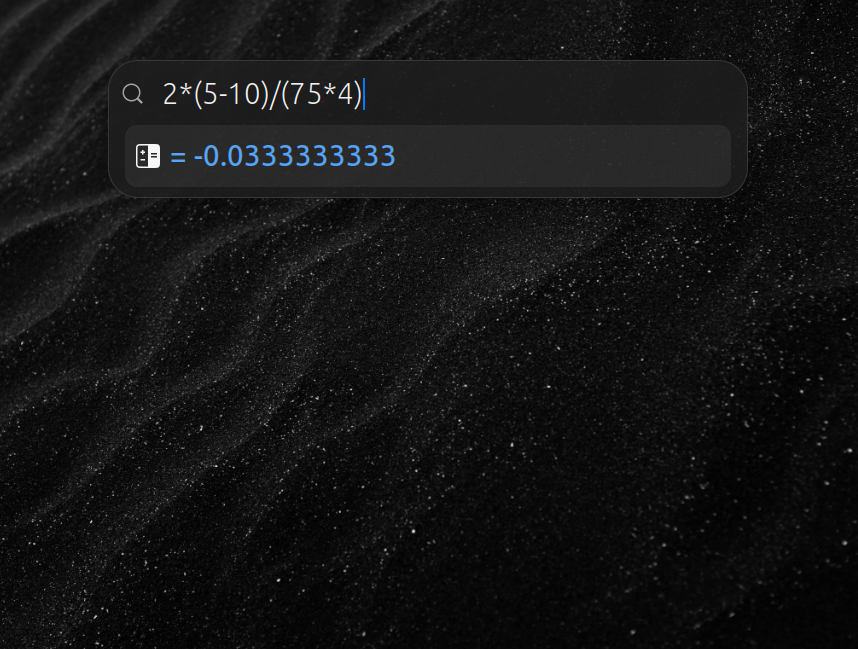
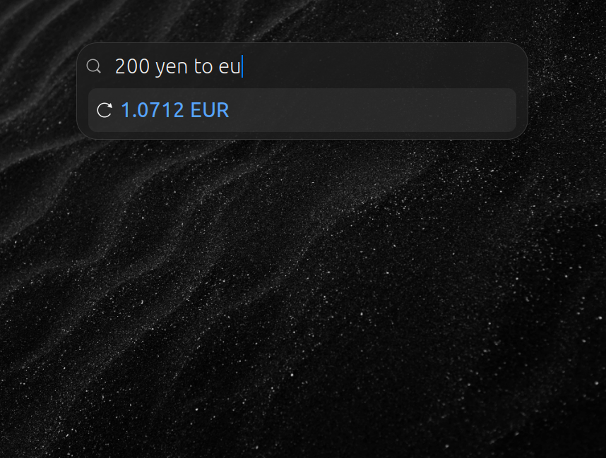
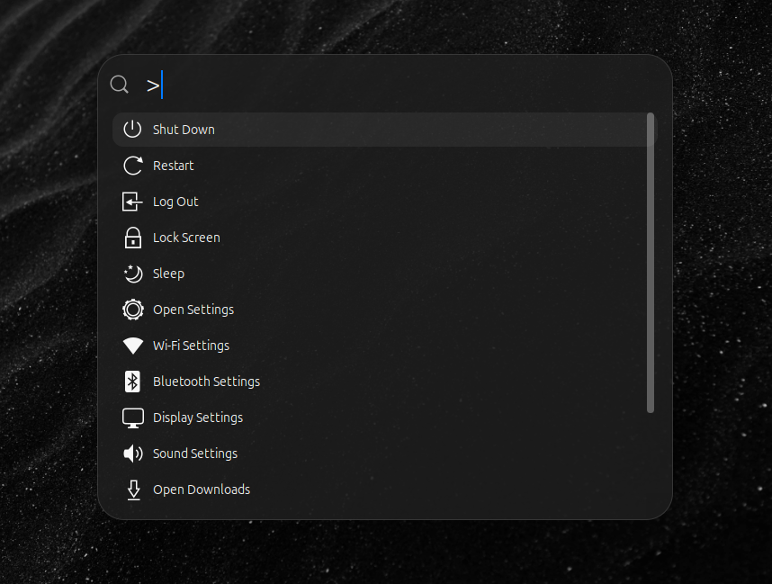
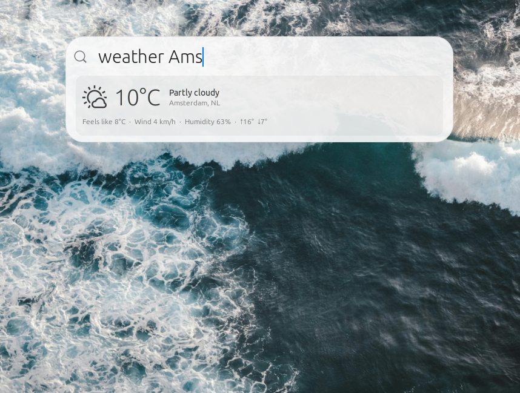
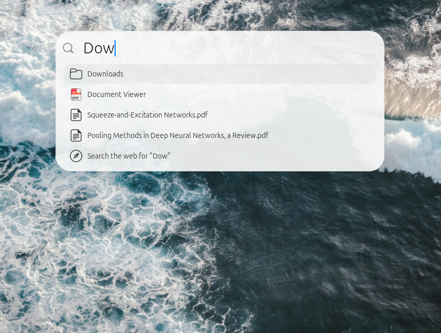

# Superbar

A keyboard-driven, system-wide launcher and command bar for GNOME Shell — inspired by macOS Spotlight.

Open it from anywhere with **Alt+Space**.


---

## Screenshots

|                                                          |                                                        |
| -------------------------------------------------------- | ------------------------------------------------------ |
|               |      |
|         |             |
|       |            |
|  |  |

---

## Features

| Feature                   | How to use                                                             |
| ------------------------- | ---------------------------------------------------------------------- |
| **App Launcher**          | Type the app name — fuzzy match, launches or focuses                   |
| **Window Switcher**       | Type part of a window title — jumps across workspaces                  |
| **File Search**           | Type a filename — searches home dir and common folders                 |
| **Clipboard History**     | `clip:` or `clipboard:` prefix — browse last 50 entries                |
| **Weather**               | `weather <city>` — live temp, humidity, wind (Open-Meteo, no API key)  |
| **Calculator**            | Type a math expression e.g. `2 * (3 + 4)` — result copied to clipboard |
| **Currency Converter**    | `100 USD to EUR`                                                       |
| **Dictionary**            | `define <word>` — English definitions via Free Dictionary API          |
| **Web Search**            | Any unmatched query falls through to a web search                      |
| **System Commands**       | `shutdown`, `reboot`, `logout`, `lock`, `suspend`, `screenshot`        |
| **Resumable Searches**    | Reopen a dismissed search within five minutes; typing replaces it      |
| **Adaptive Ranking**      | Prioritizes strong matches, active context, and selected apps/actions  |
| **Multi-Monitor Aware**   | Opens on the focused monitor and stays inside its usable work area     |
| **Configurable Shortcut** | Change the toggle keybinding in GNOME Extensions preferences           |

---

## Installation

### From GNOME Extensions (recommended)

> **Note:** The extension is currently under review by the GNOME Extensions team and is not yet available on [extensions.gnome.org](https://extensions.gnome.org). In the meantime, please use the manual installation method below.

[Superbar on Gnome Extensions Marketplace](https://extensions.gnome.org/extension/9778/superbar/) - Soon!

### Manual

```bash
git clone https://github.com/Furkan-rgb/superbar.git \
  ~/.local/share/gnome-shell/extensions/superbar@Furkan-rgb.github.io

glib-compile-schemas ~/.local/share/gnome-shell/extensions/superbar@Furkan-rgb.github.io/schemas/

gnome-extensions enable superbar@Furkan-rgb.github.io
```

Log out and back in if this is the first time installing.

---

## Requirements

- GNOME Shell 49+
- An internet connection for weather, dictionary, and currency features

## Local development and testing

The Makefile provides the common development and release commands:

```bash
make help
make test       # validate, build, and verify the ZIP
make install    # install the latest local build
make nested     # install and start a fresh nested GNOME Shell
make export     # export the upload-ready ZIP to ~/Desktop; does not install
```

The generated archive is always named
`superbar@Furkan-rgb.github.io.shell-extension.zip`. `make export` writes it to
the Desktop but does not update the installed extension. Override the export
destination when needed with `make DESKTOP_DIR=/path/to/output export`.

For development, close any existing nested Shell and run `make nested`. This
packages and installs the current source before starting a fresh Shell process;
disabling and re-enabling an extension does not reliably reload cached modules.
Once it opens, enable Superbar and inspect its state from a terminal inside the
nested desktop while in the repository directory:

```bash
make enable
make prefs
make status
```

On X11, press **Alt+F2**, enter `r`, then enable the extension. On a regular
Wayland session, log out and back in instead of restarting GNOME Shell in place.

---

## License

GPL-2.0-or-later — see [LICENSE](LICENSE)
